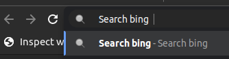
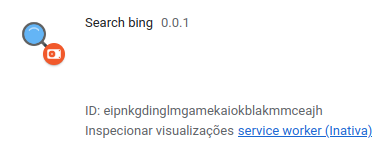

# Extenção de pesquisa

Descrição do projeto é uma extenção para pesquisa rapida por atalho bing.

### Tecnologias utilizadas no projeto;

- Html
- Css
- Javascript
- Typescript [Site](https://www.typescriptlang.org/)
- ViteJS [Site](https://vitejs.dev/)

### Build do projeto

```shell

npm run build && cd dist/

```

### Imagens




